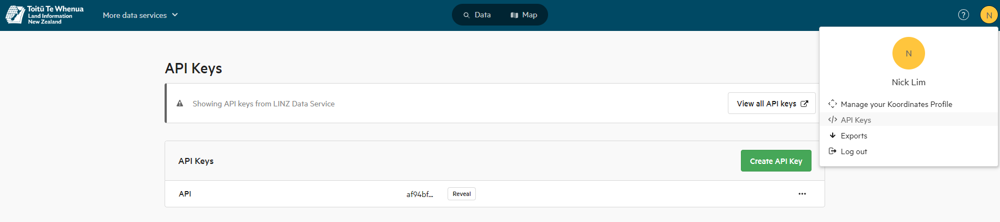

# qgis_extractor
This is a pyQGIS script to randomly sample from the LCDB5.0 database, extract images from a raster based on the random samples and generate masks of the image based on the polygons of the LCDB5.0 database

## Required API Keys
Users will need an account with Koordinates to request an API key with [https://data.linz.govt.nz] and [https://lris.scinfo.org.nz]. To apply for an account, users should click on **Log in** on the top right of the portal. Accounts are free and usually granted immediately. To generate an API key, users should click on their profile picture on the top right of the portal and select **API Keys**. 

Users may optionally obtain an API key for [https://basemaps.linz.govt.nz] for access to a bigger catalog of rasters maps. Sign up is not required, however the API Keys are on a 90 days rotation. 

** Optional plugin
Users may choose to install the LINZ Data 
